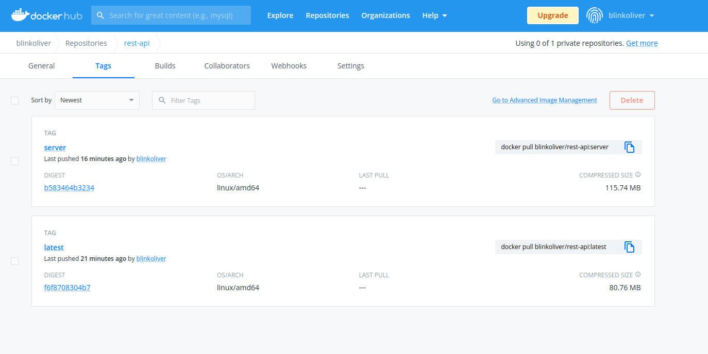

# Home Library Service with Docker

## Prerequisites

- Git - [Download & Install Git](https://git-scm.com/downloads).
- Node.js - [Download & Install Node.js](https://nodejs.org/en/download/) and the npm package manager.
- Docker Engine - [Download & Install Docker Engine](https://docs.docker.com/engine/)
- Docker Desktop - [Download & Install Docker Desktop (OPTIONAL)](https://www.docker.com/products/docker-desktop/)

## Downloading Images

```
docker pull blinkoliver/rest-api:server

docker pull blinkoliver/rest-api:latest

```

## Running app with docker-compose

```
docker-compose build

docker-compose up
```

After starting the app on port (4000 as default) you can open
in your browser OpenAPI documentation by typing http://localhost:4000/doc/.
For more information about OpenAPI/Swagger please visit https://swagger.io/.

## Containers size



## Testing

After application running open new terminal and enter:

To run all tests without authorization

```
npm run test
```

To run only one of all test suites

```
npm run test -- <path to suite>
```

To run all test with authorization

```
npm run test:auth
```

To run only specific test suite with authorization

```
npm run test:auth -- <path to suite>
```
